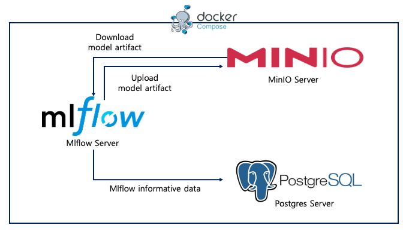
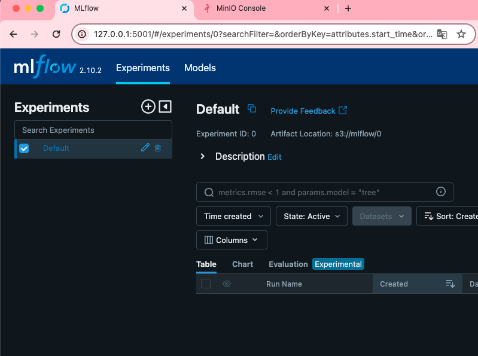
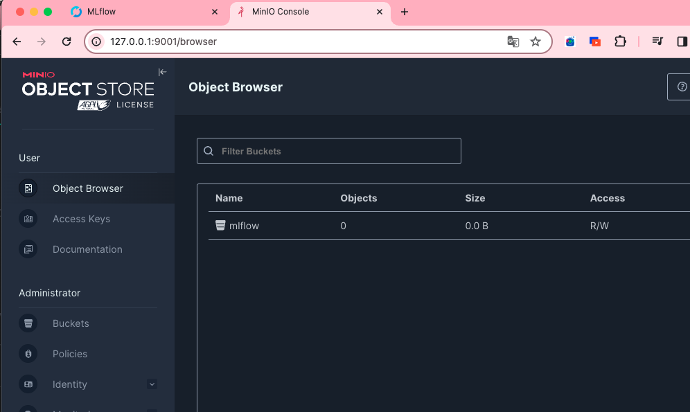
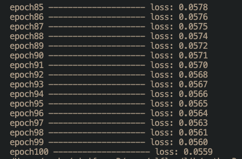
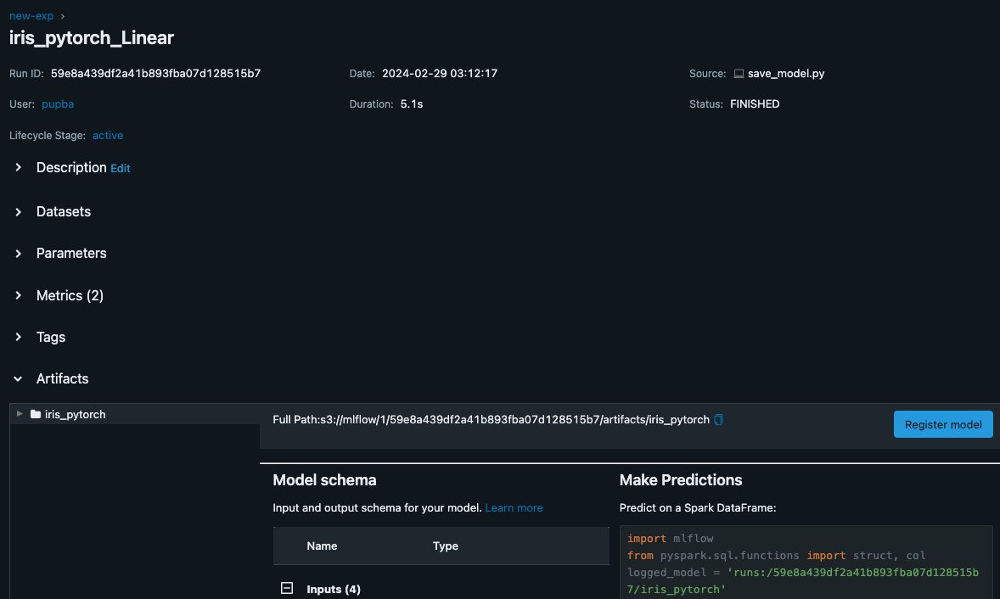
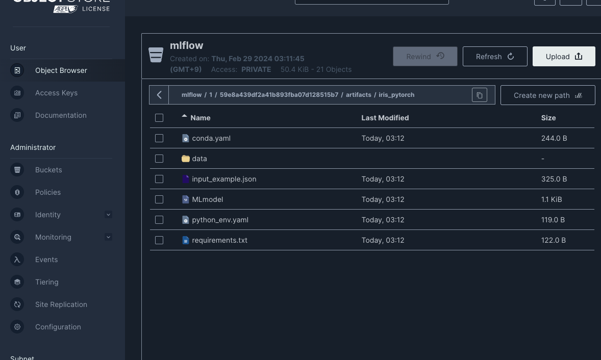
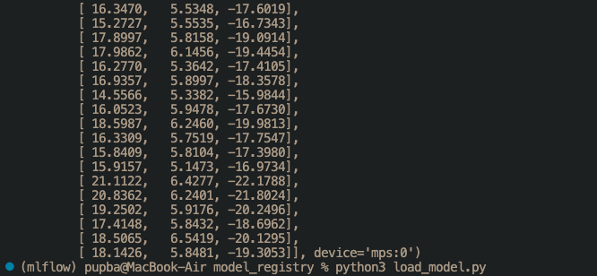

# Model-Registry

mlflow, MinIO, PostgreSQL을 사용해서 Model-Registry Project 구축.

### **시스템 구성**

### Skills

-   Docker
-   Docker-Compose
-   Python 3.9.0
-   postgres 14.0
-   minio RELEASE.2024-01-18T22-51-28Z

## 1. 실행환경을 위한 docker-compose, Dockerfile 작성

-   MLflow : `http://localhost:5001`
    
-   MinIO : `http://localhost:9001`
    

### 2. Save_model - save_model.py

-   Pytorch 모델을 만들어 학습하고 Lifecycle을 관리하기 위해 mlflow를 사용.
    
    
    

### 3. Load_model - load_model.py

-   mlflow를 사용해서 모델을 불러온다.
    
